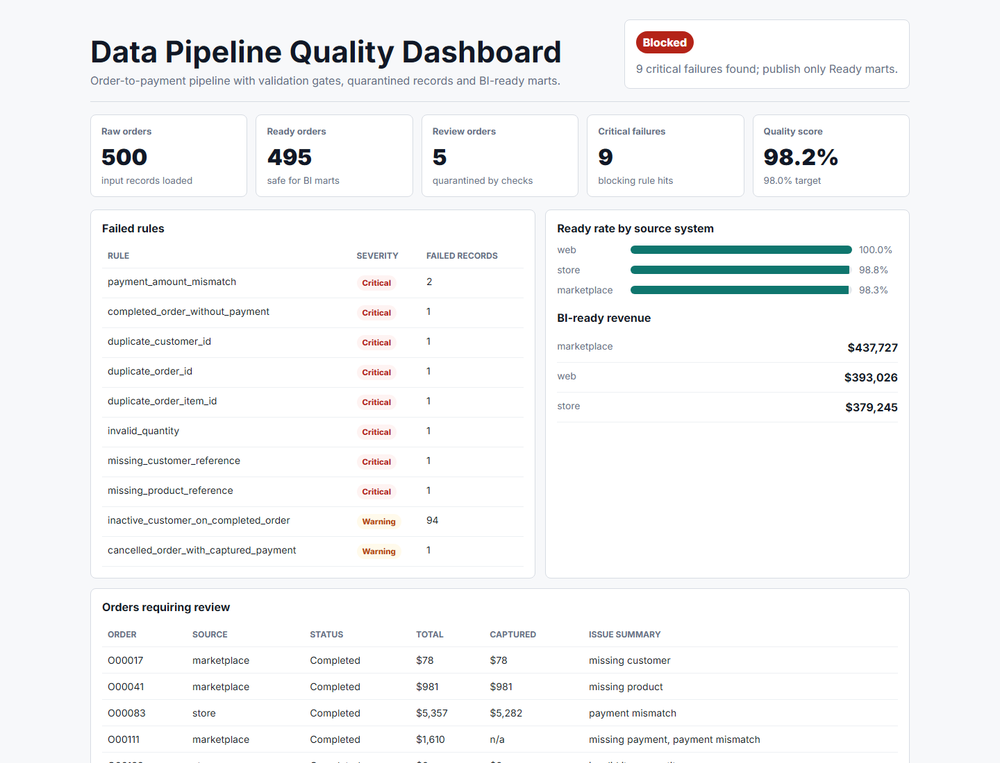

# Data Pipeline Quality Checks: why 98.2% is still not enough

[Portuguese version](README.pt-BR.md)

Data Quality and Analytics Engineering case study built around a critical question: **can the executive dashboard be refreshed safely, or should publication be blocked?**

The case simulates an order, payment, customer and product pipeline before BI publication. The core thesis is simple: a high quality score is not enough when critical failures can distort revenue, orders or executive trust.

For a strict hiring process, this case communicates three important junior-level capabilities: writing reliable SQL, thinking in data contracts and turning technical failures into a business decision.

## Executive Summary

**Core question:** are the data good enough to feed executive BI?

**Short answer:** no. The pipeline ends with status **Blocked**. Even with a **98.2%** quality score, there are still **9 critical failures**. Under the governance rule, any critical failure blocks executive publication until correction or formal approval.

**Recommended decision:** publish only marts marked as `Ready` and route `Review` records to data owners before refreshing any executive read.

| Metric | Result |
|---|---:|
| Orders evaluated | 500 |
| BI-ready orders | 495 |
| Orders in review | 5 |
| Critical failures | 9 |
| Warning failures | 95 |
| Quality score | 98.2% |
| Publication status | Blocked |

## Why This Case Matters

This project proves the portfolio is not only about clean dashboards. It shows **publication control**: knowing when data should be used, when it should be blocked and how to explain risk to business stakeholders.

Interview version: "I created a quality gate before BI and showed that 98.2% looks good, but the data is still not publishable because there are critical payment, duplicate and reference failures."

The case demonstrates:

1. **Technical rigor:** severity-based quality rules, reviewable SQL and reproducible pipeline.
2. **Contract thinking:** data only enters BI when defined criteria are met.
3. **Publication criteria:** the dashboard is not refreshed when critical failures exist.
4. **Business translation:** the final output is `Publish`, `Block` or `Review`, not just an error table.

## Business Problem

The company receives operational files from different source systems. Before feeding BI, it needs to answer:

- Are primary IDs unique?
- Does every order have a valid customer, product and payment?
- Does captured payment match the calculated item total?
- Which records should be placed under review?
- Can the executive dashboard be refreshed safely?

## Analytical Read

The most important result is the tension between score and risk. The overall score is **98.2%**, above the **98.0%** target, but the correct status is still **Blocked**. Critical rules carry more decision weight than the aggregate score.

Critical failures include issues that can affect operational trust:

- `payment_amount_mismatch`: **2** records
- `completed_order_without_payment`: **1** record
- customer, order and item duplicates: **3** failing rules
- missing customer and product references: **2** failing rules
- `invalid_quantity`: **1** record

Warnings matter too, but they play a different role: **94** inactive-customer occurrences on completed orders and **1** cancelled order with captured payment require operational follow-up, but they do not necessarily block all publication.

## Solution Built

The project creates a complete reproducible flow:

1. Generate synthetic data with controlled issues.
2. Load raw files into DuckDB.
3. Create staging tables with standardized types.
4. Run quality rules by severity.
5. Create analytical marts with review flags.
6. Export CSVs, executive findings and a static HTML dashboard.
7. Run validation through GitHub Actions on push or pull request.

## Dashboard

Open the local dashboard at:

```text
dashboard/data_pipeline_quality_dashboard.html
```

Explicit language variants are also generated:

```text
dashboard/data_pipeline_quality_dashboard_en.html
dashboard/data_pipeline_quality_dashboard_pt-BR.html
```



The dashboard shows publication status, ready orders, review orders, critical failures, quality score, failed rules, source-system quality and records requiring correction.

## Main Quality Rules

| Rule | Severity | Current result |
|---|---|---:|
| Payment amount mismatch | Critical | 2 |
| Completed order without payment | Critical | 1 |
| Duplicate customer ID | Critical | 1 |
| Duplicate order ID | Critical | 1 |
| Duplicate order item ID | Critical | 1 |
| Invalid quantity | Critical | 1 |
| Missing customer reference | Critical | 1 |
| Missing product reference | Critical | 1 |
| Inactive customer on completed order | Warning | 94 |
| Cancelled order with captured payment | Warning | 1 |

## Generated Outputs

- `outputs/executive_findings.md`: English executive findings.
- `outputs/executive_findings.pt-BR.md`: Portuguese executive findings.
- `outputs/dq_summary.csv`: rules by severity.
- `outputs/failed_rules.csv`: failed rules.
- `outputs/quality_score.csv`: overall score and critical failures.
- `outputs/orders_by_quality_status.csv`: Ready vs Review orders.
- `outputs/source_system_quality.csv`: readiness by source system.
- `outputs/records_requiring_review.csv`: records that require action.
- `outputs/dashboard_data.json`: data used by the HTML dashboard.

## Stack

- Python for synthetic data generation and orchestration.
- SQL for ingestion, staging, validation and marts.
- DuckDB as a local analytical database.
- Pandas for artifact export.
- GitHub Actions for automated validation.
- Dependency-free HTML/CSS for the static dashboard.

## Reproduce

```bash
pip install -r requirements.txt
python scripts/build_outputs.py
python scripts/run_pipeline.py
```

The first Python command generates data, DuckDB database, CSVs, dashboard and executive findings. The second prints the main queries to the terminal for technical review.

## Publication Criteria

BI publication should be blocked when:

- at least one critical failure exists;
- or the quality score is below 98%;
- or revenue records enter review without a responsible owner's decision.

This follows the same logic as modern data quality tools: tests return failing rows and the results guide a decision to publish, block or investigate. Conceptual benchmarks: [dbt data tests](https://docs.getdbt.com/docs/build/data-tests) and [Great Expectations validations](https://docs.greatexpectations.io/docs/core/introduction/gx_overview).

## Simulated Recommendations

1. Block executive publication while critical failures exist.
2. Fix payment mismatches and completed orders without payment first, because they affect revenue trust.
3. Resolve duplicates and missing references before recalculating KPIs.
4. Publish only `Ready` records in separate marts and keep `Review` records traceable.
5. Keep warnings visible in an operational panel without mixing them with critical blockers.

## Author

Bruno Nascimento  
[LinkedIn](https://linkedin.com/in/bruniversamente) | [GitHub](https://github.com/bruniversamente)
