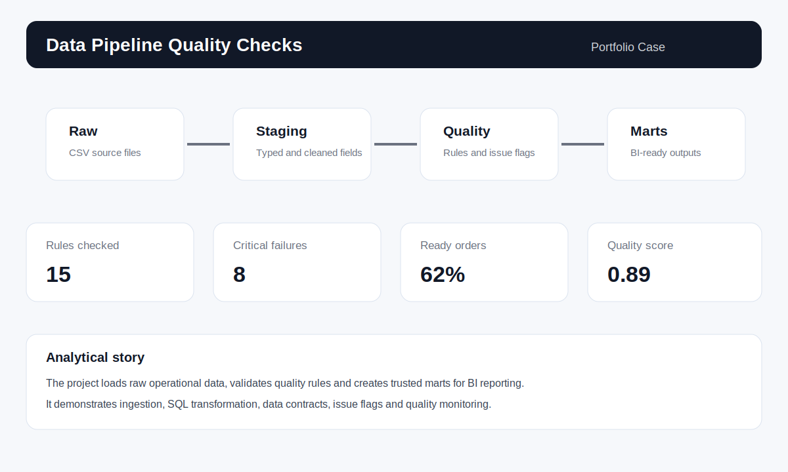

# Data Pipeline Quality Checks

Portfolio project focused on building a small analytical data pipeline with ingestion, staging, transformation and data quality checks. The goal is to simulate how raw operational data can be validated and transformed into trusted analytical tables.

The dataset is synthetic and created only for portfolio purposes. It simulates a real analytics engineering scenario using Python, SQL, DuckDB, data contracts, validation rules and documentation.

## Business problem

A company receives operational files from different systems: orders, customers, products and payments. Before using these files in dashboards or reports, the data team needs to validate consistency, detect issues and create a clean analytical layer.

Main questions:

- Are all required fields present and valid?
- Are there duplicated records?
- Do orders have valid customers and products?
- Are payment amounts consistent with order totals?
- Which records should be flagged before analytics consumption?
- Can the pipeline produce a trusted table for BI and KPI reporting?

## Project goal

Build a reproducible local pipeline that loads raw CSV files, creates staging tables, applies transformations, runs quality checks and produces curated analytical outputs.

## Skills demonstrated

- Python for orchestration and synthetic data generation.
- SQL for ingestion, transformation and analytical modeling.
- DuckDB as a local analytical engine.
- Data quality checks for completeness, uniqueness, referential integrity and business rules.
- Documentation of data contracts, data dictionary and pipeline steps.
- Analytics-ready outputs for Power BI or other BI tools.

## Repository structure

```text
data-pipeline-quality-checks/
├── data/
│   ├── raw/
│   │   ├── sample_customers.csv
│   │   ├── sample_orders.csv
│   │   ├── sample_order_items.csv
│   │   ├── sample_payments.csv
│   │   └── sample_products.csv
│   └── README.md
├── docs/
│   ├── business_rules.md
│   ├── data_contract.md
│   ├── data_dictionary.md
│   └── pipeline_blueprint.md
├── images/
│   └── pipeline_preview.svg
├── scripts/
│   ├── generate_raw_data.py
│   └── run_pipeline.py
├── sql/
│   ├── 01_load_raw_tables.sql
│   ├── 02_create_staging_tables.sql
│   ├── 03_data_quality_checks.sql
│   ├── 04_create_marts.sql
│   └── 05_kpi_queries.sql
├── tests/
│   └── quality_thresholds.md
├── requirements.txt
└── README.md
```

## Pipeline layers

The project uses a simple medallion-style structure:

1. Raw layer: direct load from CSV files.
2. Staging layer: typed fields, normalized names and basic transformations.
3. Quality layer: validation checks and issue flags.
4. Mart layer: analytics-ready tables for BI.

## Quality checks

The project includes checks for:

- Required fields not null
- Duplicate IDs
- Invalid dates
- Negative quantities or amounts
- Products missing from the product dimension
- Customers missing from the customer dimension
- Orders without payment
- Payment amount different from order total
- Cancelled orders with captured payment

## Main outputs

- `mart_orders`: clean order-level table for BI.
- `mart_order_items`: clean item-level table for product analysis.
- `dq_summary`: data quality summary by rule.
- SQL queries for KPIs and quality monitoring.

## Pipeline preview



## How to run locally

1. Clone the repository:

```bash
git clone https://github.com/bruniversamente/data-pipeline-quality-checks.git
cd data-pipeline-quality-checks
```

2. Install dependencies:

```bash
pip install -r requirements.txt
```

3. Run the pipeline:

```bash
python scripts/run_pipeline.py
```

4. Generate a larger synthetic dataset if needed:

```bash
python scripts/generate_raw_data.py
```

## Expected insights

This pipeline helps identify:

1. Data quality problems before dashboard publication.
2. Operational records that need correction.
3. Data sources with higher inconsistency rates.
4. Differences between order totals and payment amounts.
5. Clean analytical tables ready for BI reporting.

## Simulated business recommendations

- Block dashboard refresh when critical quality checks fail.
- Review orders with payment mismatch before reporting revenue.
- Create alerts for duplicate IDs and missing dimension references.
- Maintain a data contract with required fields and accepted values.
- Monitor quality score over time as a data governance KPI.

## Next steps

- Add a Power BI dashboard for pipeline and quality monitoring.
- Add automated tests in a GitHub Actions workflow.
- Add a simple data quality score by source and date.
- Publish the case in the main portfolio website.

## Author

Bruno Nascimento  
[LinkedIn](https://linkedin.com/in/bruniversamente) | [GitHub](https://github.com/bruniversamente)
