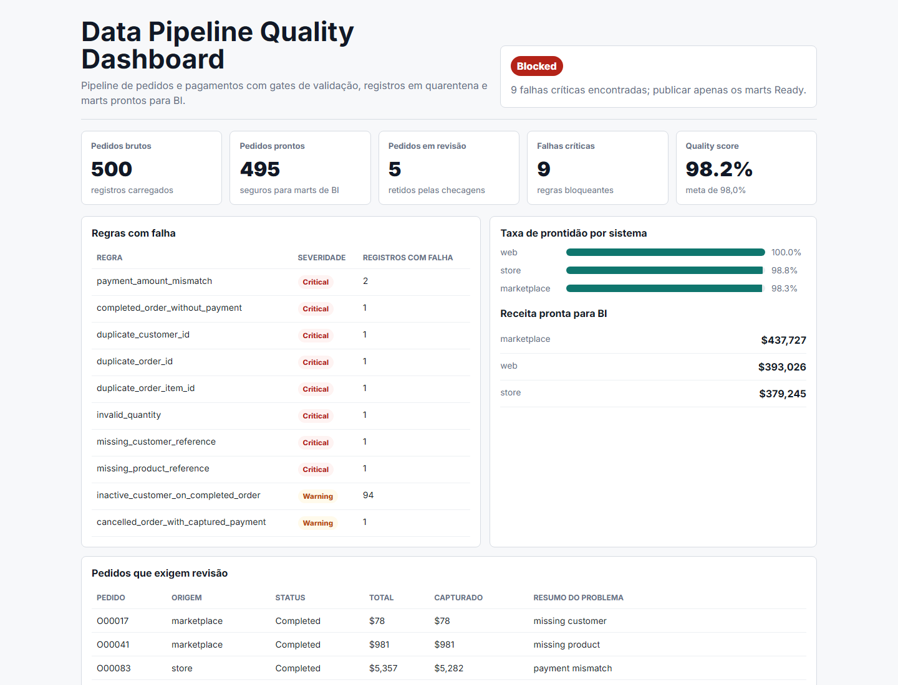

# Data Pipeline Quality Checks: quando 98,2% ainda não basta

[English version](README.md)

Estudo de caso de Data Quality e Analytics Engineering para responder uma pergunta crítica: **o dashboard executivo pode ser atualizado com segurança ou a publicação precisa ser bloqueada?**

O case simula um pipeline de pedidos, pagamentos, clientes e produtos antes da publicação de BI. A tese principal é simples: um quality score alto não basta quando ainda existem falhas críticas que podem distorcer receita, pedidos ou confiança executiva.

Em uma empresa rigorosa, este caso comunica três capacidades importantes para uma vaga júnior: escrever SQL confiável, pensar em contratos de dados e transformar problemas técnicos em decisão de negócio.

## Resumo executivo

**Pergunta central:** os dados estão bons o suficiente para alimentar BI executivo?

**Resposta curta:** não. O pipeline termina com status **Blocked**. Mesmo com **98,2%** de quality score, ainda existem **9 falhas críticas**. Pela regra de governança, qualquer falha crítica bloqueia a publicação executiva até correção ou aprovação formal.

**Decisão recomendada:** publicar apenas os marts marcados como `Ready` e rotear os registros em `Review` para os donos de dados antes de atualizar qualquer leitura executiva.

| Indicador | Resultado |
|---|---:|
| Pedidos avaliados | 500 |
| Pedidos prontos para BI | 495 |
| Pedidos em revisão | 5 |
| Falhas críticas | 9 |
| Falhas de warning | 95 |
| Quality score | 98,2% |
| Status de publicação | Blocked |

## Por que este case importa no portfólio

Este projeto é a prova de que o portfólio não mostra apenas dashboards bonitos. Ele mostra **controle de publicação**: saber quando um dado deve ser usado, quando deve ser bloqueado e como explicar o risco para negócio.

Em uma entrevista, a história pode ser defendida assim: "eu criei um gate de qualidade antes do BI e mostrei que 98,2% de score parece bom, mas ainda não é publicável porque existem falhas críticas em pagamento, duplicidade e referências."

O case demonstra:

1. **Rigor técnico:** regras de qualidade por severidade, SQL revisável e pipeline reproduzível.
2. **Pensamento de contrato:** dados só entram no BI quando respeitam critérios definidos.
3. **Critério de publicação:** o dashboard não é atualizado quando há falha crítica.
4. **Tradução para negócio:** o resultado final é `Publish`, `Block` ou `Review`, não só uma tabela de erros.

## Problema de negócio

A empresa recebe arquivos operacionais de diferentes sistemas. Antes de alimentar BI, ela precisa responder:

- Os IDs principais estão únicos?
- Cada pedido tem cliente, produto e pagamento válido?
- O valor capturado no pagamento bate com o total calculado dos itens?
- Quais registros devem ser colocados em revisão?
- O dashboard executivo pode ser atualizado com segurança?

## Leitura analítica

O resultado mais importante do case é a tensão entre score e risco. O score geral está em **98,2%**, acima da meta de **98,0%**, mas o status correto ainda é **Blocked**. Isso acontece porque as regras críticas têm peso decisório maior que o score agregado.

As falhas críticas estão distribuídas em problemas que podem afetar confiança operacional:

- `payment_amount_mismatch`: **2** registros
- `completed_order_without_payment`: **1** registro
- duplicidades de cliente, pedido e item: **3** regras com falha
- referências ausentes de cliente e produto: **2** regras com falha
- `invalid_quantity`: **1** registro

Os warnings também importam, mas com outro papel: há **94** ocorrências de cliente inativo em pedido concluído e **1** pedido cancelado com pagamento capturado. Esses casos não necessariamente bloqueiam tudo, mas precisam de acompanhamento operacional.

## Solução construída

O projeto cria um fluxo completo e reproduzível:

1. Gera dados sintéticos com problemas controlados.
2. Carrega arquivos brutos em DuckDB.
3. Cria tabelas de staging com tipos padronizados.
4. Executa regras de qualidade por severidade.
5. Cria marts analíticos com flags de revisão.
6. Exporta CSVs, resumo executivo e dashboard HTML.
7. Roda no GitHub Actions a cada push ou pull request.

## Dashboard

Abra o dashboard local em:

```text
dashboard/data_pipeline_quality_dashboard_pt-BR.html
```

Preview:



O dashboard mostra status de publicação, pedidos prontos, pedidos em revisão, falhas críticas, score de qualidade, regras quebradas, qualidade por sistema de origem e registros que precisam de correção.

## Principais regras de qualidade

| Regra | Severidade | Resultado atual |
|---|---|---:|
| Payment amount mismatch | Critical | 2 |
| Completed order without payment | Critical | 1 |
| Duplicate customer ID | Critical | 1 |
| Duplicate order ID | Critical | 1 |
| Duplicate order item ID | Critical | 1 |
| Invalid quantity | Critical | 1 |
| Missing customer reference | Critical | 1 |
| Missing product reference | Critical | 1 |
| Inactive customer on completed order | Warning | 94 |
| Cancelled order with captured payment | Warning | 1 |

## Saídas geradas

Os principais artefatos ficam em `outputs/`:

- `executive_findings.md`: resumo executivo em inglês.
- `executive_findings.pt-BR.md`: resumo executivo em português.
- `dq_summary.csv`: regras por severidade.
- `failed_rules.csv`: regras com falha.
- `quality_score.csv`: score geral e falhas críticas.
- `orders_by_quality_status.csv`: pedidos Ready vs Review.
- `source_system_quality.csv`: taxa de prontidão por sistema.
- `records_requiring_review.csv`: pedidos que precisam de ação.
- `mart_orders_preview.csv`: amostra da tabela de pedidos.
- `mart_order_items_preview.csv`: amostra da tabela de itens.
- `dashboard_data.json`: dados usados no dashboard HTML.

## Stack

- Python para geração de dados e orquestração.
- SQL para ingestão, staging, validação e marts.
- DuckDB como banco analítico local.
- Pandas para exportação dos artefatos.
- GitHub Actions para validação automatizada.
- HTML/CSS sem dependências externas para o dashboard.

## Como rodar

```bash
pip install -r requirements.txt
python scripts/build_outputs.py
python scripts/run_pipeline.py
```

O primeiro comando de Python gera dados, banco DuckDB, CSVs, dashboard e resumo executivo. O segundo imprime as consultas principais no terminal para revisão técnica.

## Estrutura

```text
data-pipeline-quality-checks/
├── dashboard/
│   └── data_pipeline_quality_dashboard.html
├── data/
│   └── raw/
├── docs/
├── images/
│   └── dashboard_preview.png
├── outputs/
├── scripts/
│   ├── build_outputs.py
│   ├── generate_raw_data.py
│   └── run_pipeline.py
├── sql/
├── tests/
└── README.md
```

## Critério de publicação

A publicação de BI deve ser bloqueada quando:

- existe pelo menos uma falha crítica;
- ou o quality score fica abaixo de 98%;
- ou registros de receita entram em revisão sem decisão de um responsável.

Esse critério segue a mesma lógica de ferramentas modernas de qualidade de dados: testes devem retornar linhas com falha e os resultados precisam orientar a decisão de publicar, bloquear ou investigar. Referências usadas como benchmark conceitual: [dbt data tests](https://docs.getdbt.com/docs/build/data-tests) e [Great Expectations validations](https://docs.greatexpectations.io/docs/core/introduction/gx_overview).

## Recomendações simuladas

1. Bloquear a publicação executiva enquanto existirem falhas críticas.
2. Corrigir primeiro divergências de pagamento e pedidos concluídos sem pagamento, porque afetam confiança em receita.
3. Tratar duplicidades e referências ausentes antes de recalcular KPIs.
4. Publicar apenas registros `Ready` em marts separados, mantendo registros `Review` rastreáveis.
5. Manter warnings visíveis em painel operacional, sem misturá-los com bloqueios críticos.

## Autor

Bruno Nascimento  
[LinkedIn](https://linkedin.com/in/bruniversamente) | [GitHub](https://github.com/bruniversamente)
